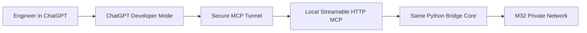
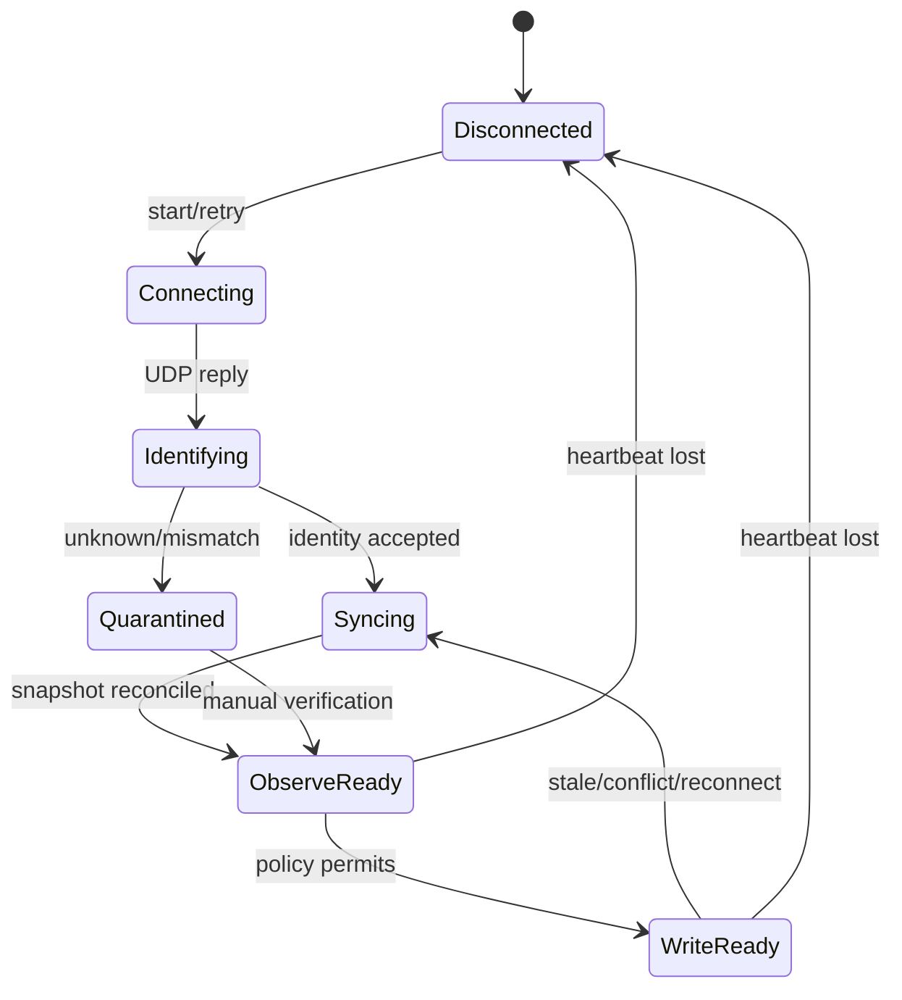
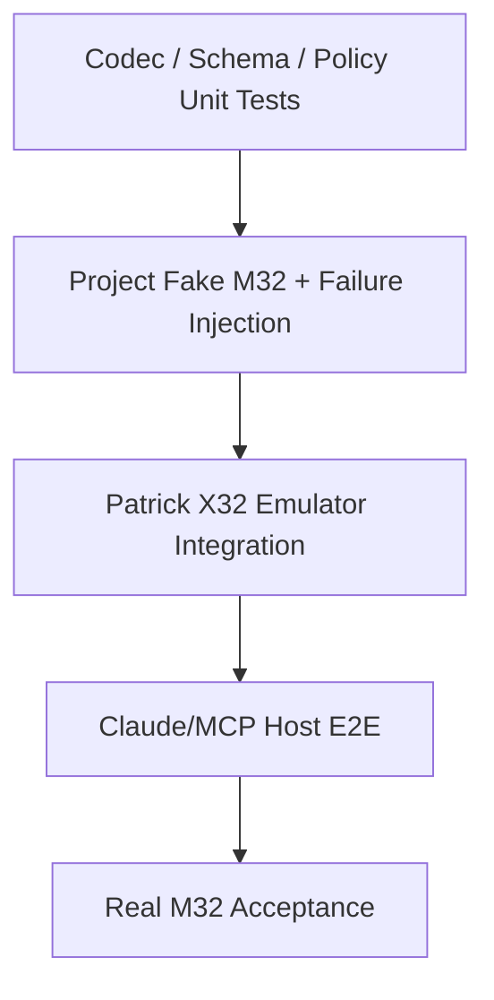
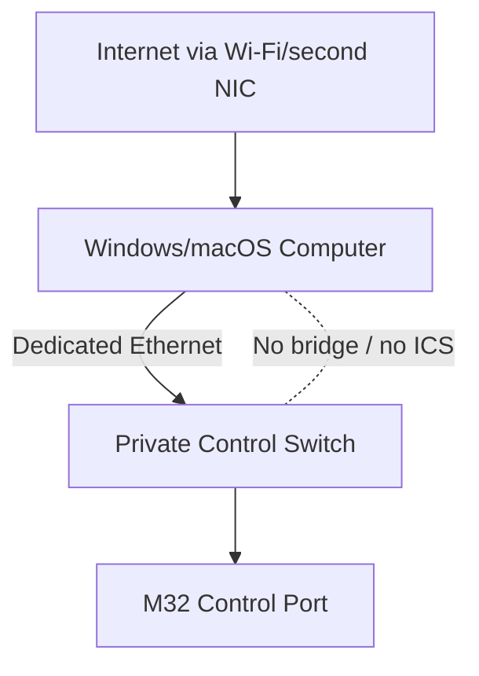

# Implementation Plan Canvas: M32 AI MCP Bridge — MVP

**SpecKit Feature**: `001-m32-mcp-bridge`  
**Status**: Approved architecture / Ready for specification and implementation  
**Date**: 2026-07-19  
**Primary platform**: Windows 10/11  
**Secondary platform**: macOS compatible with intel/silicon
**Target console**: Midas M32 Live running the latest stable official firmware  
**Primary AI host**: Claude Desktop through local MCP `stdio`  
**Secondary AI host**: ChatGPT/Antigravity/Codex through remote MCP transport and Secure MCP Tunnel, when Developer Mode is available  
**Document role**: Self-contained SpecKit implementation canvas and source of truth for the MVP

---

## 1. Executive Summary

Build a small, local, Python-based bridge that exposes the Midas M32 console as safe MCP tools to Claude Desktop and, later, ChatGPT. The user continues to work inside the normal Claude or ChatGPT conversation. The project does **not** build another AI chat interface, mixer UI, or full frontend.

The bridge connects directly to the console using OSC/UDP, maintains an authoritative live state cache, detects manual changes performed on the physical console, provides structured read and analysis tools to the model, and executes approved changes using a proposal → approval → write → readback → audit workflow.

The MVP will be developed and validated without physical hardware by using:

1. deterministic unit and protocol tests;
2. a Python Fake M32 server maintained by this project;
3. Patrick-Gilles Maillot's X32 Emulator as an external OSC integration target;
4. MCP Inspector and Claude Desktop end-to-end tests;
5. a final, explicitly separate hardware acceptance phase when the real M32 becomes available.

Passing emulator tests proves the software's OSC and MCP behavior. It does **not** prove hardware compatibility until the hardware acceptance suite passes.

---

## 2. Product Canvas

| Canvas area | Decision |
|---|---|
| Problem | Claude/ChatGPT cannot safely read, analyze, and control an M32 directly. |
| User | Sound engineer/developer supervising concerts, conferences, meetings, school theatre, and outdoor stages. |
| Primary outcome | Ask questions and issue approved commands in Claude/ChatGPT while the bridge reads and controls the real console. |
| MVP interface | The existing Claude Desktop or ChatGPT conversation. |
| Local component | One Python modular-monolith MCP bridge. |
| Console protocol | Ethernet OSC over UDP, normally port `10023`. |
| Audio analysis in MVP | Console meters, gain reduction, current RTA source, routing, processing, clock, and sync state through OSC. |
| Audio analysis after MVP | Simultaneous USB 32×32 PCM capture, FFT/STFT, feedback and delay analysis. |
| Human control | The user approves write tools inside the AI host; server policy remains authoritative. |
| Frontend | None in MVP. CLI status and logs only. |
| Storage | In-memory state cache, JSON snapshots, JSONL audit log. |
| Deployment | Local Windows/macOS process; no public console exposure. |
| Cost constraint | No Pi, ESP32, Stream Deck, OpenX32, hosting, or additional hardware for MVP. |

---

## 3. Scope

### 3.1 MVP In Scope

- Local OSC connection to a real or emulated M32/X32 endpoint.
- Direct IP connection and localhost emulator connection.
- Runtime console identity, model, firmware, and capability discovery.
- Full supported state snapshot for firmware 4.x documented paths.
- Live state synchronization using `/xremote` plus selective reconciliation reads.
- Correct conversion between OSC raw values and displayed dB/frequency/time/enumeration values.
- Detection of physical/manual fader, mute, headamp, trim, EQ, dynamics, send, and routing changes when published by the console.
- Channel, bus, matrix, main, DCA, headamp, routing, FX, clock, AES50, card, meter, RTA, scene/cue/snippet, talkback, and recorder reads where supported.
- MCP tools for structured state queries and deterministic diagnostics.
- Event preflight and best-practice recommendations using console evidence.
- Explicit Measurement Microphone role in venue/event configuration.
- Proposal-based safe writes with approval, conflict detection, readback, audit, and targeted rollback.
- Claude Desktop local MCP integration using `stdio`.
- Optional ChatGPT MCP transport using Streamable HTTP and Secure MCP Tunnel after the local MVP is stable.
- Emulator, MCP, failure-injection, and later hardware acceptance tests.
- A minimal `m32-live-engineer` knowledge pack/skill for signal flow, SOPs, vocabulary, and safety instructions.

### 3.2 Explicitly Out of Scope for MVP

- A custom chat application.
- A full mixer frontend or clone of M32-Edit.
- React, Electron, or a general-purpose WebUI.
- Local or cloud LLM provider adapters.
- OpenAI or Anthropic API billing integrations.
- USB 32×32 PCM capture.
- Simultaneous 32-channel FFT/STFT.
- Fully automatic feedback suppression.
- Automatic room/speaker delay alignment.
- Raspberry Pi, ESP32, Stream Deck, Companion runtime, or mobile applications.
- OpenX32 firmware installation.
- Firmware modification or reverse engineering of the console operating system.
- Public exposure of OSC or the console network.
- Automatic phantom-power enable.
- Live sample-rate or clock-source changes.
- SD-card formatting, console shutdown, or firmware operations through AI.

### 3.3 Post-MVP Roadmap

- USB/CoreAudio/ASIO audio capture abstraction.
- Multi-channel DSP analyzer.
- Feedback watch/warning/critical state machine.
- Semi-automatic EQ cut proposals.
- Measurement-mic impulse response and delay alignment.
- Optional minimal local approval/status page if AI-host confirmations prove insufficient.
- Optional LiveStageAssistant voice layer above the safe MCP gateway.

### 3.4 Assumptions and Dependencies

#### Assumptions

- The physical console will run the latest stable official M32 firmware when hardware acceptance begins.
- OSC is enabled and the computer can reach the console's control Ethernet interface on the private network.
- M32 firmware 4.x largely shares the documented X32 OSC surface, but every hardware-sensitive path remains unverified until tested.
- The physical console, expansion card, and stageboxes are unavailable during initial implementation.
- The user can install Python/`uv`, Claude Desktop, and developer-only emulator tools on the test computer.
- Claude Desktop is the first operational MCP host; ChatGPT transport is optional and depends on Developer Mode being available to the user's account.
- Venue/event channel dictionaries and protected-path rules will be supplied before event-specific recommendations are trusted.
- The user remains present for every sensitive write and will not enable permanent automatic approval for write tools.

#### Dependencies

- Official MCP Python SDK stable `1.x`.
- A project-owned Python Fake M32 for repeatable automated testing.
- Patrick-Gilles Maillot's X32 Emulator as an independent, opt-in local integration target.
- MCP Inspector and Claude Desktop for host-level validation.
- The real M32 for the final hardware acceptance gate.

---

## 4. Constitution — Non-Negotiable Principles

The following `MUST` statements are implementation gates.

1. **Console Authority** — Live console replies are the authoritative source of operational state; model memory is never authoritative.
2. **Read Before Write** — Every write proposal must be based on a fresh read or snapshot revision.
3. **No Raw AI OSC** — No generic `send_raw_osc`, `set_any_path`, or arbitrary address tool may be exposed to the model.
4. **Proposal Separation** — Analysis/proposal and execution are separate MCP tools and separate user-visible actions.
5. **Human Approval** — Sensitive writes require the MCP host's explicit tool confirmation. Write tools must never be configured as `Always Allow`.
6. **Readback Verification** — Every successful write must be read back and compared using the console's real resolution/grid.
7. **Conflict Rejection** — If state changes after a proposal is created, the proposal must fail instead of overwriting the engineer's manual change.
8. **Audit Every Write** — Every attempted write records actor/host, proposal, path, old value, requested value, readback, result, time, and latency.
9. **Staleness Visibility** — Unknown, stale, unsupported, emulator-only, and unverified values must be labeled explicitly.
10. **Fail Closed** — Loss of heartbeat, stale state, malformed packets, unknown firmware, or capability mismatch disables writes.
11. **Manual Control Wins** — Physical console changes take priority. Automation must not fight a manual gesture.
12. **No Automatic Phantom** — Phantom power is read and warned about, but enabling it is manual-only in MVP.
13. **No Live Clock Changes** — Sample rate and clock source are inspected during setup; changes remain manual-only and prohibited in `LIVE`.
14. **Backup Before High Risk** — Headamp, routing, scene/cue/snippet recall, and bulk operations require a snapshot before execution.
15. **Targeted Rollback First** — Roll back only the parameters changed by the proposal before considering a full scene recall.
16. **Evidence-Bounded Analysis** — OSC meters are levels, not simultaneous per-channel spectra. RTA conclusions must identify the current RTA source.
17. **Emulator Honesty** — Emulator success may never be displayed or documented as hardware verification.
18. **Private Network** — OSC remains on the dedicated local console network. No port forwarding or Internet-exposed UDP.
19. **Skills Are Not Security** — Prompt/skill instructions guide the model; all permissions and blocking rules must also exist in server code.
20. **Minimal Architecture** — The MVP remains a modular monolith with no frontend, microservices, external database, or unnecessary runtime dependency.

---

## 5. User Scenarios & Testing

### Primary User Stories

### US-001 — Connect and Prove Live State (P1)

As an engineer, I want the bridge to connect to an emulator or M32 and prove that values come from that endpoint, so I can trust subsequent AI answers.

**Independent test**: Connect to an emulator, read Channel 1 gain, change it outside the MCP tool, then confirm the MCP returns the new value and timestamp.

**Acceptance scenario**:

- Given a reachable OSC target and `OBSERVE` mode,
- When the target reports Channel 1 headamp gain as `+10.0 dB`,
- And an external client changes it to `+6.0 dB`,
- Then the bridge reports `+6.0 dB`, a newer revision, `source=osc_event|reconciliation_read`, and a non-stale timestamp.

### US-002 — Query the Console Through Claude (P1)

As an engineer, I want to ask Claude about channels, buses, routing, clock, meters, and processing, so I do not need to manually inspect every page.

**Independent test**: Claude calls read-only MCP tools against the emulator and accurately summarizes structured tool results.

### US-003 — Event Preflight and Setup Advice (P1)

As an engineer, I want the model to inspect the current console configuration and return evidence-based best-practice recommendations for the event.

**Independent test**: A seeded emulator scene containing routing, gain, mute, dynamics, and clock issues produces deterministic findings and a separate recommendation plan.

### US-004 — Safe Approved Write (P1)

As an engineer, I want the model to propose a change and apply it only after my confirmation, so I retain control of the console.

**Independent test**: A proposed fader change executes only after tool confirmation, is read back, audited, and can be rolled back.

### US-005 — Manual Change Conflict Protection (P1)

As an engineer, I want a proposal to be rejected if I manually change the console after the proposal was created.

**Independent test**: Change the target fader between proposal and execute; execution returns `CONFLICT` and sends no OSC write.

### US-006 — Measurement Microphone Awareness (P2)

As an engineer, I want the model to know which channel is the measurement microphone and how it is allowed to be used.

**Independent test**: The configured measurement channel is excluded from Main recommendations, is eligible as an RTA source, and never triggers automatic phantom enable.

### US-007 — RTA-Assisted Soundcheck (P2)

As an engineer, I want the model to read and interpret the current RTA source during soundcheck and optionally scan configured sources sequentially.

**Independent test**: The bridge reports RTA data with source identity; a sequential scan saves and restores the original RTA source even after interruption.

### US-008 — Recover From Connection Failure (P2)

As an engineer, I want writes disabled during disconnection and state reconciled after reconnect.

**Independent test**: Stop the emulator, observe write lockout, restart it, and confirm identity plus reconciliation completes before writes are re-enabled.

---

## 6. Functional Requirements

### Connection and Discovery

- **FR-001** The bridge shall connect to a configured IPv4 OSC target and UDP port.
- **FR-002** The bridge shall support `emulator`, `hardware-unverified`, and `hardware-verified` environment labels.
- **FR-003** The bridge shall query identity, model, firmware, and capability information at startup.
- **FR-004** The bridge shall renew `/xremote` before the console subscription expires.
- **FR-005** The bridge shall detect heartbeat/reply loss and transition to a disconnected, write-locked state.
- **FR-006** The bridge shall reconnect with bounded backoff and perform identity plus state reconciliation before restoring writes.

### State and Telemetry

- **FR-010** The bridge shall build a typed snapshot of all supported console containers.
- **FR-011** The bridge shall maintain an in-memory state cache with monotonic revision numbers.
- **FR-012** Every cached field shall include value, display value, source, observed time, freshness, and support status.
- **FR-013** The bridge shall process `/xremote` changes and selective polling/reconciliation reads.
- **FR-014** The bridge shall preserve the distinction between headamp gain, channel digital trim, and channel fader.
- **FR-015** The bridge shall decode supported meter banks and identify each value's signal position.
- **FR-016** The bridge shall report RTA data only with the selected RTA source and acquisition settings.
- **FR-017** The bridge shall expose clock rate/source/mode, expansion-card sync, and AES50 A/B state.

### Analysis

- **FR-020** Deterministic preflight rules shall run locally before the model writes prose or recommendations.
- **FR-021** Findings shall include severity, evidence paths, observed values, confidence/source, and recommended next action.
- **FR-022** Recommendations shall be separate from executable operations.
- **FR-023** The bridge shall never represent per-channel meters as per-channel frequency spectra.
- **FR-024** Sequential RTA scanning, if enabled, shall be restricted to `SOUNDCHECK`, save original settings, and restore them on success, failure, or cancellation.
- **FR-025** The event profile shall explicitly identify the measurement microphone role, routing constraints, and phantom policy.

### Safe Write

- **FR-030** Every write shall originate from a stored proposal with an ID, digest, snapshot revision, expiration, operations, risks, and rollback values.
- **FR-031** The execution tool shall reject missing, expired, already-used, modified, or state-conflicted proposals.
- **FR-032** The policy engine shall check operation risk, runtime mode, path allowlist, bounds, rate limits, and required snapshot.
- **FR-033** Writes shall be serialized per affected console resource to prevent overlapping changes.
- **FR-034** Every write shall be read back with retry and bounded timeout.
- **FR-035** A failed verification shall produce a failed transaction and targeted rollback when safe.
- **FR-036** Headamp, routing, recall, bulk, and talkback configuration operations shall require `SOUNDCHECK` or an explicitly enabled high-risk policy plus snapshot.
- **FR-037** Phantom enable, sample-rate/clock change, firmware, shutdown, and SD format shall remain blocked in MVP.
- **FR-038** Physical/manual changes shall invalidate conflicting proposals.

### MCP and Host Integration

- **FR-040** The primary MCP transport shall be local `stdio` for Claude Desktop.
- **FR-041** The optional secondary transport shall be Streamable HTTP bound to loopback/private interfaces only.
- **FR-042** ChatGPT connectivity shall use Secure MCP Tunnel or another approved outbound secure tunnel; the OSC endpoint shall never be public.
- **FR-043** Read tools shall declare read-only behavior; write tools shall declare destructive/sensitive behavior for host confirmation.
- **FR-044** Tool outputs shall be structured JSON-compatible objects, not unstructured console logs.
- **FR-045** No local AI provider integration is required; the MCP host supplies the model and conversation.

### Audit and Recovery

- **FR-050** Audit records shall be append-only JSONL during MVP.
- **FR-051** Sensitive values and secrets shall not be logged.
- **FR-052** Snapshots shall be JSON files with schema version, identity, firmware, time, and checksum.
- **FR-053** The CLI shall support health/doctor, snapshot, verify-connection, and audit-tail operations.
- **FR-054** Emergency write lock shall be available through configuration/CLI and take effect without restarting the console.

---

## 7. Measurable Success Criteria

- **SC-001** A manual/emulated fader, mute, or gain change is visible in state within `500 ms p95` under normal local network conditions.
- **SC-002** Returned display values match the console's documented resolution; headamp comparisons respect the real gain grid.
- **SC-003** A supported full snapshot completes within `5 seconds p95` on the local emulator and reports incomplete sections explicitly.
- **SC-004** `100%` of write attempts have an audit record, including rejected operations.
- **SC-005** `100%` of successful writes have matching readback verification.
- **SC-006** `OBSERVE` mode sends no state-changing OSC packets in integration tests.
- **SC-007** Every blocked R4 path remains blocked under direct tool calls, malformed proposals, and model-supplied custom paths.
- **SC-008** A stale/disconnected state prevents all writes within `1 second` of detected heartbeat failure.
- **SC-009** After the target returns, identity and critical state reconciliation complete before write unlock.
- **SC-010** Proposal conflict tests send zero target writes after an external/manual state change.
- **SC-011** The system correctly labels `emulator`, `hardware-unverified`, and `hardware-verified` in every status response.
- **SC-012** Claude Desktop can list, call, and receive valid results from all MVP MCP tools.
- **SC-013** The external X32 Emulator integration suite passes on at least the primary Windows development environment.
- **SC-014** The final hardware acceptance suite demonstrates live manual gain/fader change detection before the project claims hardware readiness.

---

## 8. Technical Context

| Area | Decision |
|---|---|
| Language | Python `3.12` |
| Architecture | Local modular monolith |
| MCP SDK | Official MCP Python SDK stable `1.x`, exact version pinned |
| Primary transport | MCP `stdio` |
| Optional transport | MCP Streamable HTTP, disabled by default |
| OSC transport | `asyncio` UDP with a project-owned codec/adapter; `python-osc` may be used only where wire behavior matches M32 |
| Validation | Pydantic v2 models at MCP/config/proposal boundaries |
| State | In-memory typed cache with revisions |
| Persistence | JSON snapshots and append-only JSONL audit |
| Configuration | YAML plus environment-variable overrides for deployment secrets/addresses |
| Testing | pytest, pytest-asyncio, property tests where useful, MCP Inspector, external emulator, later hardware suite |
| Packaging | `uv` during development; PyInstaller or MCPB evaluated after functional MVP |
| Logging | Structured logs to `stderr` for `stdio`; never write logs to `stdout` |
| UI | None in MVP |
| Network | Dedicated private console Ethernet; computer may use a separate interface for Internet |

### 8.1 Dependency Policy

- Pin exact production dependency versions.
- Keep the OSC codec and value conversion layer independently testable.
- Avoid a web framework unless Streamable HTTP deployment requires the MCP SDK's supported server runtime.
- Do not make Companion, LiveStageAssistant, M32-Edit, or community binaries runtime dependencies.
- Record third-party licenses before copying any source or tables.
- Do not redistribute Patrick's emulator or other binaries unless redistribution rights are confirmed.

---

## 9. Architecture

### 9.1 MVP Runtime


### 9.2 Optional ChatGPT Transport



### 9.3 Trust Boundaries

| Boundary | Trust rule |
|---|---|
| AI model → MCP tool | All input is untrusted and schema-validated. |
| MCP tool → policy | Tool names do not grant authority; policy re-checks every operation. |
| Policy → OSC | Only typed, allowlisted operations can create packets. |
| UDP → state cache | All replies are parsed defensively; target identity and source endpoint are checked. |
| Emulator → readiness claim | Emulator data is test evidence only, never hardware attestation. |
| Internet interface → console interface | No Windows Network Bridge/ICS; OSC stays private. |

### 9.4 Connection State Machine



---

## 10. Project Structure

```text
m32-ai-bridge/
├── .specify/
│   └── memory/
│       └── constitution.md
├── specs/
│   └── 001-m32-mcp-bridge/
│       ├── spec.md
│       ├── plan.md
│       ├── research.md
│       ├── data-model.md
│       ├── quickstart.md
│       ├── contracts/
│       │   ├── mcp-tools.md
│       │   ├── config.schema.json
│       │   ├── proposal.schema.json
│       │   └── audit.schema.json
│       └── tasks.md
├── src/
│   └── m32_bridge/
│       ├── __main__.py
│       ├── cli.py
│       ├── config.py
│       ├── domain/
│       │   ├── models.py
│       │   ├── values.py
│       │   └── capabilities.py
│       ├── osc/
│       │   ├── codec.py
│       │   ├── transport.py
│       │   ├── client.py
│       │   ├── subscriptions.py
│       │   ├── meters.py
│       │   ├── schema.py
│       │   └── discovery.py
│       ├── state/
│       │   ├── cache.py
│       │   ├── snapshot.py
│       │   ├── sync.py
│       │   └── freshness.py
│       ├── diagnostics/
│       │   ├── preflight.py
│       │   ├── routing.py
│       │   ├── gain.py
│       │   ├── clock.py
│       │   └── rta.py
│       ├── policy/
│       │   ├── modes.py
│       │   ├── permissions.py
│       │   ├── proposals.py
│       │   ├── executor.py
│       │   └── rollback.py
│       ├── mcp/
│       │   ├── server.py
│       │   ├── read_tools.py
│       │   ├── analysis_tools.py
│       │   └── write_tools.py
│       └── audit/
│           ├── writer.py
│           └── schemas.py
├── knowledge/
│   └── m32-live-engineer/
│       ├── signal-flow.md
│       ├── routing-dictionary.md
│       ├── event-sop.md
│       ├── virtual-soundcheck-sop.md
│       └── safety-policy.md
├── tests/
│   ├── unit/
│   ├── property/
│   ├── fake_mixer/
│   ├── emulator/
│   ├── mcp/
│   └── hardware/
├── fixtures/
│   ├── scenes/
│   ├── osc_packets/
│   └── event_profiles/
├── config.example.yaml
├── pyproject.toml
├── README.md
└── PLAN.md
```

---

## 11. Core Data Model

### ConsoleIdentity

- `environment`: emulator | hardware-unverified | hardware-verified
- `model`
- `name`
- `firmware`
- `ip`
- `osc_port`
- `capability_profile`
- `verified_at`

### StateValue

- `path`
- `raw_value`
- `native_value`
- `display_value`
- `unit`
- `revision`
- `observed_at`
- `source`: snapshot | osc_event | reconciliation_read | write_readback
- `freshness`: fresh | aging | stale | unknown
- `support`: supported | unsupported | unverified

### Proposal

- `proposal_id`
- `digest`
- `created_at`
- `expires_at`
- `base_revision`
- `runtime_mode`
- `operations[]`
- `risk_summary`
- `required_confirmation`
- `snapshot_reference`
- `status`: proposed | approved-by-host | executing | verified | failed | rolled-back | expired | conflicted

### Operation

- `typed_action`
- `target`
- `path`
- `before`
- `requested`
- `bounds`
- `risk_level`
- `reason`
- `rollback_value`

### EventProfile

- event name/type/date
- venue
- channel/bus/output dictionary
- expected stagebox/AES50 topology
- measurement microphone channel and purpose
- protected paths
- gain/headroom targets
- mode-specific permissions
- known-good snapshot/scene reference

### AuditRecord

- time and transaction ID
- AI host/tool caller
- console identity/environment
- proposal ID/digest
- old/requested/readback values
- policy decision
- network/result/latency
- rollback result

---

## 12. Runtime Modes and Permissions

### 12.1 Modes

| Mode | Purpose | Writes |
|---|---|---|
| `OFFLINE` | Snapshots/fixtures only | No console writes |
| `OBSERVE` | Read, monitor, analyze | None |
| `SOUNDCHECK` | Setup, diagnostics, approved configuration | R1–R3 by policy |
| `LIVE` | Performance monitoring and small corrective actions | R1 and limited R2 only |
| `EMERGENCY` | AI write-lock only: stop automation and cancel pending proposals | Block all AI console writes, AI mute, and AI rollback; return to OBSERVE only after reconciliation |

### 12.2 Risk Levels

| Level | Examples | MVP rule |
|---|---|---|
| R0 | Status, snapshot, meters, RTA read, routing read | Automatic read |
| R1 | Mute, small fader adjustment, label | Proposal + host confirmation unless explicitly pre-authorized |
| R2 | Sends, EQ cut, dynamics, talkback momentary action | Proposal + host confirmation + bounds |
| R3 | Headamp, routing, scene/cue/snippet recall, bulk | `SOUNDCHECK`, snapshot, explicit high-risk enable, host confirmation |
| R4 | Phantom enable, sample-rate/clock change, firmware, shutdown, SD format | Blocked in MVP |

### 12.3 Default Bounds

- Fader change: maximum `±3 dB` per approved operation in `LIVE`; configurable lower limit.
- EQ: no automatic boosts for feedback treatment; proposed cuts only, bounded gain and Q.
- Headamp: no writes in `LIVE`; soundcheck only with source mapping shown.
- Main: protected by default.
- Routing: soundcheck only; show affected destinations and snapshot first.
- Recall: show scope/safes and capture snapshot before recall.
- Talkback: momentary action separated from configuration changes.
- Measurement microphone: excluded from Main by profile; phantom remains manual.

---

## 13. MCP Contract Canvas

The exact tool schema belongs in `contracts/mcp-tools.md`; the MVP surface remains intentionally small.

### 13.1 Read Tools

| Tool | Result |
|---|---|
| `m32_console_status` | Identity, environment, connection, firmware, mode, freshness, write lock |
| `m32_get_overview` | Compact console-wide status |
| `m32_list_channels` | Channel identity, role, source, activity, freshness |
| `m32_get_channel` | Headamp, trim, strip, mix, sends, processing, routing evidence |
| `m32_get_bus` | Bus state, sends, processing, output mapping |
| `m32_get_routing` | Input blocks, User In/Out, physical outputs, AES50/card routes |
| `m32_get_clock_sync` | Rate, source, mode, card/AES50 status |
| `m32_get_meters` | Named meter snapshot with signal positions and units |
| `m32_get_rta` | RTA bands plus selected source and settings |
| `m32_get_changes` | State changes since revision/time |
| `m32_capture_snapshot` | Versioned snapshot reference and completeness report |
| `m32_compare_snapshots` | Typed diff with risk classification |
| `m32_trace_signal` | Input → headamp → channel → sends/buses → outputs |

### 13.2 Analysis Tools

| Tool | Result |
|---|---|
| `m32_event_preflight` | Clock, sync, routing, protection, measurement mic, readiness blockers |
| `m32_analyze_gain_staging` | Evidence-based gain/headroom findings |
| `m32_analyze_routing` | Broken, duplicate, orphaned, or unsafe paths |
| `m32_analyze_processing` | Gate/compressor/EQ configuration findings |
| `m32_analyze_rta` | Current-source spectral observations; no false per-channel claim |
| `m32_recommend_event_setup` | Recommendations and proposed operations, not writes |

### 13.3 Write Workflow Tools

| Tool | Behavior |
|---|---|
| `m32_propose_changes` | Validate typed actions, calculate risk/diff/rollback, create expiring proposal |
| `m32_execute_proposal` | Host-confirmed execution with conflict check and readback |
| `m32_verify_proposal` | Re-read affected paths and report exact result |
| `m32_rollback_proposal` | Targeted rollback using stored pre-values and fresh conflict checks |

### 13.4 Prohibited Tools

- `send_raw_osc`
- `set_any_path`
- `execute_shell`
- `format_sd`
- `shutdown_console`
- `set_firmware`
- `enable_phantom`
- `set_sample_rate`

---

## 14. Initial Event Preflight

The event preflight is a mandatory read/analysis workflow, not an autonomous setup routine.

1. Verify console identity and latest stable firmware response.
2. Read clock rate, source, and mode.
3. Read AES50 A/B and expansion-card sync state.
4. Capture a full snapshot.
5. Load the event profile/channel dictionary.
6. Confirm measurement microphone channel and protected routing.
7. Trace input sources and output destinations.
8. Inspect headamp/trim/fader gain structure.
9. Inspect HPF, EQ, gate, compressor, inserts, sends, bus processing, and Main protection.
10. Read meter snapshots and current RTA source.
11. Produce `blocker`, `warning`, and `advisory` findings.
12. Produce a proposed setup plan without applying it.
13. Convert approved recommendations into an expiring proposal.
14. Execute only after host confirmation and verify every result.

### Sample Rate/Sync Rule

Sample-rate synchronization applies to digital devices and clock domains, not independently to every audio channel. The MVP reads and validates:

- console clock rate/source/mode;
- AES50 A/B status;
- expansion-card sync status;
- event expectations.

Changing rate/source is blocked in MVP and must be performed manually before the event, followed by a fresh preflight.

---

## 15. Measurement Microphone Model

Example event profile entry:

```yaml
channels:
  - channel: 32
    name: Measurement Mic
    role: measurement_microphone
    location: FOH
    purpose:
      - room_rta
      - delay_measurement
    main_send_allowed: false
    rta_source_allowed: true
    phantom_required_by_device: true
    phantom_policy: manual_only
```

Rules:

- The role must be configured, never inferred only from the channel name.
- The channel is excluded from ordinary vocal/instrument heuristics.
- Main and monitor sends are protected unless the event profile explicitly changes them.
- The AI may recommend phantom based on verified device documentation but cannot enable it.
- RTA source changes are saved/restored and permitted only in soundcheck.
- Full delay/impulse analysis remains post-MVP because it requires PCM audio capture.

---

## 16. Testing and Emulator Strategy

### 16.1 Test Pyramid



### 16.2 Layer A — Unit and Property Tests

Required coverage:

- OSC string/int/float/blob packing and alignment.
- Strict OSC type handling.
- Raw ↔ native ↔ displayed value conversion.
- dB/fader/headamp grids and boundary values.
- Meter blob parsing, truncation, endianness, and corrupt packet rejection.
- Capability/path validation.
- Proposal digest, expiration, conflict, and one-time-use behavior.
- Risk and mode matrix.
- Audit serialization.
- Snapshot checksum and schema migration.

No network or emulator is required for this layer.

### 16.3 Layer B — Project-Owned Fake M32

Implement a deterministic Python UDP fake for automated tests. It is not intended to emulate audio or the complete console; it implements the exact behavior required by tests.

Required behaviors:

- `/xinfo`/identity replies.
- `/node` reads for seeded containers.
- selected leaf reads/writes.
- `/xremote` change notifications.
- meter blob fixtures and scheduled synthetic updates.
- write echo/readback.
- external/manual change injection.
- dropped replies, delayed packets, malformed packets, duplicate packets, out-of-order packets, and restart simulation.
- state persistence for the duration of a test.

Advantages:

- reproducible CI on Windows/macOS/Linux;
- deterministic failure injection;
- no third-party binary redistribution;
- exact test scenarios for policy and synchronization.

### 16.4 Layer C — Patrick-Gilles Maillot X32 Emulator

Use the community X32 Emulator as an external behavioral integration target. It parses many real X32/M32 OSC commands, maintains console-like state, supports `/xremote`, `/node`, meter requests, and multiple clients. It does not process audio and does not support every current firmware command.

Sources:

- `https://github.com/pmaillot/X32-Behringer`
- `https://github.com/JoueBien/X32-OSC-Workbench`

Platform plan:

- **Windows**: use the Workbench-provided `X32.exe` for initial local testing or compile the current `X32.c` using MSYS2/MinGW.
- **macOS**: compile `X32.c`; the binary included by `x32-mcp-server` is Apple Silicon only and may be used locally after verification.
- **CI**: do not depend on or redistribute the third-party binary; CI uses the project Fake M32. External-emulator tests are an opt-in developer suite.

External emulator test scenarios:

1. identity and capability handshake;
2. leaf read → external write → state update;
3. MCP write → emulator readback;
4. `/node` container snapshot;
5. multi-client `/xremote` updates;
6. meter snapshot decoding;
7. disconnect/restart/reconnect;
8. proposal conflict after external change;
9. write lock in `OBSERVE`;
10. snapshot comparison and targeted rollback.

Limitations recorded in every test report:

- no real audio;
- fake meter values;
- incomplete current-firmware coverage;
- no proof of physical headamp/AES50/card behavior;
- no cryptographic console identity.

### 16.5 Layer D — MCP Protocol and Host Tests

- Run MCP Inspector against `stdio`.
- Verify tool discovery and JSON schemas.
- Invoke every read tool against Fake M32 and external emulator.
- Verify `stdout` contains MCP protocol only and logs go to `stderr`.
- Test cancellation, timeout, malformed model input, and concurrent read calls.
- Connect Claude Desktop and execute a scripted acceptance conversation.
- Confirm write tools trigger host confirmation and document that `Always Allow` is prohibited.

### 16.6 Layer E — Hardware Acceptance

This layer is blocked until the real M32 is available. It is mandatory before production use.

Required evidence:

1. rear expansion-card identification;
2. Setup/Global and Setup/Network screenshots or direct reads;
3. Routing Inputs/Card/AES50 topology;
4. console identity and firmware read;
5. physical challenge: user moves a requested fader/gain and bridge observes the correct path/value/time;
6. read-only full snapshot and comparison with M32-Edit;
7. safe mute/fader write on an isolated test channel;
8. manual change conflict rejection;
9. disconnect/reconnect and stale-state lockout;
10. targeted rollback;
11. clock/AES50/card sync preflight;
12. current-source RTA read and source restoration test.

The console is labeled `hardware-verified` only after these tests pass for its identity and firmware profile.

### 16.7 Reliability Gates

| Gate | Pass condition |
|---|---|
| Codec gate | Golden packets and malformed packet suite pass. |
| Fake gate | Manual change, failure injection, reconnect, conflict, and rollback pass deterministically. |
| Emulator gate | External UDP read/write/readback and `/xremote` integration suite passes. |
| MCP gate | Inspector plus Claude Desktop tools pass without protocol/log corruption. |
| Safety gate | R4 paths blocked and no raw-path bypass found. |
| Hardware gate | Physical challenge and isolated safe-write suite pass. |

---

## 17. Community Project Use Plan

| Project | MVP use | Runtime dependency? |
|---|---|---|
| `elisha-rudenkov/x32-mcp-server` | Behavioral/schema reference for node reads, routing, FX, snapshots, meters, discovery | No; selectively reimplement in Python |
| `pmaillot/X32-Behringer` | Primary community protocol reference and external emulator | Emulator only for local tests; no redistribution until license is confirmed |
| `JoueBien/X32-OSC-Workbench` | Windows emulator convenience, packet testing, learning reference | No |
| `CristianMoresi/M32LiveConsoleTool` | Manual override, resubscription, meter validation, simulator and control-loop test ideas | No; MIT ideas may be adapted with attribution |
| `infrafast/LiveStageAssistant` | Optional post-MVP voice/MCP client layer | No |
| `bitfocus/companion-module-behringer-x32` | Action coverage and OSC behavior reference | No |
| `HealGaren/feedguard` | Post-MVP analyzer roadmap reference | No implementation dependency |

License gate:

- Record repository commit, license file/metadata, copied artifacts, and attribution.
- Projects without a clear root license are reference-only until clarified.
- Prefer independent implementation from protocol behavior and tests over copying large code blocks.

---

## 18. Security and Failure Model

### Major Threats

| Threat | Mitigation |
|---|---|
| Model calls dangerous tool | Minimal typed tool surface, risk policy, host confirmation, R4 block |
| Prompt injection requests raw OSC | No raw tool exists; server validates paths and actions |
| UDP spoofing on console LAN | Dedicated private network, source endpoint checks, no untrusted clients |
| Lost UDP write/reply | Readback, bounded retries, transaction status |
| Stale cached value | Freshness TTL, reconciliation, fail-closed writes |
| AI overwrites manual engineer change | Revision/digest conflict detection |
| ChatGPT tunnel exposes console | Tunnel terminates at MCP bridge; OSC is never routed publicly |
| Log leaks secrets | No API keys; redact configuration and tunnel credentials |
| Emulator mistaken for hardware | Mandatory environment label and physical challenge gate |
| Scene recall causes broad change | Soundcheck-only, snapshot, scope report, explicit high-risk confirmation |

### Network Topology



---

## 19. Observability and Operational Controls

### CLI Commands

```text
m32-bridge doctor
m32-bridge run --transport stdio
m32-bridge run --transport streamable-http
m32-bridge verify-connection
m32-bridge snapshot --output snapshot.json
m32-bridge audit-tail
m32-bridge lock-writes
m32-bridge unlock-writes --mode soundcheck
```

### Required Status Fields

- environment and identity;
- transport and target;
- last valid packet time;
- state revision and snapshot completeness;
- clock/AES50/card summary;
- write lock and mode;
- pending proposal count;
- last transaction result;
- emulator/hardware verification state.

No WebUI is required. If later added, it may show only these status fields, pending approval, and emergency write lock; it must not become a mixer clone or chat interface.

---

## 20. Delivery Phases

### Phase 0 — SpecKit Foundation

**Goal**: Freeze requirements and safety rules before coding.

Deliverables:

- constitution;
- technology ADR;
- protocol/emulator research;
- MCP/config/proposal/audit contracts;
- data model;
- quickstart;
- dependency/license register;
- dependency-ordered task list.

Exit gate:

- spec, plan, contracts, and tasks pass consistency analysis;
- no unresolved question changes MVP architecture.

### Phase 1 — OSC Core and Deterministic Fake

**Goal**: Reliable local OSC behavior without AI or hardware.

Implementation:

- OSC codec and UDP transport;
- value conversion and capability registry;
- Python Fake M32;
- identity, leaf read/write, `/node`, `/xremote`, meter fixtures;
- state cache and freshness;
- failure injection.

Exit gate:

- unit/property/fake suites pass;
- external change `10 dB → 6 dB` is observed correctly;
- disconnect immediately write-locks state.

### Phase 2 — External Emulator Integration

**Goal**: Validate against an independent community implementation.

Implementation:

- developer setup for Patrick X32 Emulator on Windows/macOS;
- emulator integration test marker/profile;
- read/write/readback, node snapshot, xremote, meters, reconnect, conflict tests.

Exit gate:

- external emulator reliability gate passes;
- unsupported emulator paths are catalogued rather than silently ignored.

### Phase 3 — Read-Only MCP MVP

**Goal**: Use Claude Desktop as the interface to live/emulated console state.

Implementation:

- MCP `stdio` server;
- status, overview, channel, bus, routing, clock, meters, RTA, changes, snapshot, compare, trace tools;
- Claude Desktop configuration;
- MCP Inspector and host E2E tests.

Exit gate:

- user can query current values in Claude;
- external/manual emulator changes appear in subsequent answers;
- no write packet can be emitted in `OBSERVE`.

### Phase 4 — Diagnostics and Event Setup

**Goal**: Evidence-based setup advice before any automated write.

Implementation:

- event profile and facility dictionary;
- measurement microphone role;
- clock/AES50/card preflight;
- routing, gain, processing, meter, and current-source RTA diagnostics;
- `m32-live-engineer` knowledge pack;
- structured findings and recommendation tools.

Exit gate:

- seeded problem scenes produce expected deterministic findings;
- every recommendation cites console paths/values and freshness;
- RTA outputs always name their source.

### Phase 5 — Safe Write MVP

**Goal**: Apply approved changes without overriding the engineer.

Implementation:

- proposal/digest/expiration store;
- permission and mode matrix;
- host-confirmed execute tool;
- conflict check, serialization, bounds, readback, audit;
- targeted rollback;
- R1/R2 operations, then gated R3 soundcheck operations.

Exit gate:

- all write success criteria pass on Fake and external emulator;
- blocked operations remain blocked;
- conflict injection sends no write;
- rollback restores verified pre-values.

### Phase 6 — ChatGPT Transport

**Goal**: Reuse the same core from ChatGPT without building a UI.

Implementation:

- Streamable HTTP transport behind configuration flag;
- loopback/private binding and authentication as required;
- Secure MCP Tunnel deployment instructions;
- ChatGPT tool scan and approval tests.

Exit gate:

- same contracts pass on both transports;
- no console address/port is Internet-exposed;
- write confirmations remain explicit.

This phase may occur after hardware validation if Claude Desktop is sufficient for the MVP launch.

### Phase 7 — Hardware Acceptance

**Goal**: Prove behavior on the actual latest-stable-firmware M32.

Implementation:

- gather hardware/card/stagebox topology;
- run the read-only and physical challenge suite;
- compare snapshot with M32-Edit;
- run isolated safe-write/rollback tests;
- record firmware-specific capability deltas.

Exit gate:

- hardware acceptance passes;
- identity becomes `hardware-verified`;
- production/live use remains disabled until the user signs off.

### Phase 8 — Post-MVP Analyzer

**Goal**: Add the previously agreed level-two analyzer.

Implementation is a separate SpecKit feature and includes:

- USB 32×32 capture;
- ASIO/CoreAudio backend research;
- multi-channel FFT/STFT;
- feedback persistence/growth detection;
- measurement-mic delay and impulse response;
- semi-automatic cut proposals under new governance and validation.

This phase does not block the control/analysis MVP.

---

## 21. Suggested Vertical Task Slices

Tasks must be generated formally in `tasks.md`; this canvas establishes the dependency order.

1. **VS-01 Console proof** — codec + fake + identity + one gain read/change/readback test.
2. **VS-02 Live synchronization** — xremote renew/events + revisions + change query.
3. **VS-03 Snapshot** — typed channel/headamp/mix snapshot with completeness report.
4. **VS-04 External emulator** — run independent UDP integration test.
5. **VS-05 Claude read tool** — connect status and Channel 1 query through MCP.
6. **VS-06 Console-wide reads** — buses, routing, clock, meters, RTA, signal trace.
7. **VS-07 Event preflight** — event profile + clock/routing/gain deterministic checks.
8. **VS-08 Safe fader proposal** — propose, confirm, execute, readback, audit.
9. **VS-09 Manual conflict** — external change invalidates proposal.
10. **VS-10 Rollback** — targeted recovery from verified and partial failures.
11. **VS-11 High-risk soundcheck** — snapshot-gated headamp/routing/recall operations.
12. **VS-12 ChatGPT transport** — same tools over secure remote MCP.
13. **VS-13 Hardware acceptance** — physical challenge and isolated write proof.

---

## 22. Validation Conversation for Claude Desktop

The scripted acceptance conversation must include:

1. “هل الكونسول متصل؟ اعرض الدليل ومصدر الاتصال.”
2. “اقرأ Channel 1 واعرض Headamp Gain وTrim وFader كلٌ على حدة.”
3. External emulator/console change from `+10 dB` to `+6 dB`.
4. “ما القيمة الحالية ومتى تغيرت؟”
5. “اعرض التغييرات منذ آخر دقيقة.”
6. “افحص Clock وAES50 وRouting وأعطني blockers فقط.”
7. “حلل إعداد الحدث ولا تنفذ أي شيء.”
8. “أنشئ Proposal لتغيير Fader آمن فقط.”
9. Manually change the target before execution and confirm conflict rejection.
10. Create a fresh proposal, approve the host tool call, execute, and verify readback.
11. Roll back and verify the original value.
12. Stop the emulator and confirm all writes are locked.

---

## 23. Risks and Mitigations

| Risk | Impact | Mitigation |
|---|---|---|
| Community schema differs from M32 firmware | Wrong read/write | Runtime capabilities, hardware verification, unverified labels |
| UDP loss/reordering | Incorrect or stale state | Readback, retries, revisions, reconciliation |
| Emulator incomplete | False confidence | Fake + external emulator + mandatory hardware gate |
| Claude auto-confirms writes | Unsafe action | Destructive tool annotation, host confirmation, no Always Allow, server policy |
| Python OSC library mishandles M32 blobs | Meter/node failures | Project-owned codec tests and raw datagram fallback |
| Full snapshot is too slow | Stale analysis | Parallel bounded reads, completeness report, selective refresh |
| Headamp index differs from channel source | Wrong preamp changed | Trace physical source before headamp write; soundcheck only |
| RTA source misunderstood | Invalid spectral conclusion | Always return source identity/settings; sequential scan only in soundcheck |
| ChatGPT cannot access local stdio | Integration delay | Claude Desktop first; secure remote transport later |
| Licensing ambiguity | Redistribution/legal risk | Reference-only use, license register, no bundled third-party emulator |

---

## 24. Complexity Tracking

| Complexity | Why it is needed | Simpler alternative rejected because |
|---|---|---|
| State cache with revisions | Detect manual changes and proposal conflicts | Stateless reads cannot safely protect engineer changes |
| Project Fake plus external emulator | Reliable CI and independent protocol validation | One emulator cannot provide both determinism and independent behavior |
| Two MCP transports | Claude local first and ChatGPT later | A single remote transport adds needless MVP complexity; stdio alone cannot serve ChatGPT |
| Local deterministic diagnostics | Prevent unsupported AI conclusions | Model-only analysis may hallucinate and cannot enforce evidence paths |

No frontend, microservices, external database, or local AI integration is justified for the MVP.

---

## 25. Deferred Inputs Before Hardware Acceptance

These inputs are intentionally deferred and do not block emulator/MCP development:

1. rear-console photo showing the expansion card;
2. actual console IP/network configuration;
3. Setup → Global/Network state;
4. Routing → Inputs/Card/AES50 state;
5. stagebox models and connections;
6. actual firmware version returned by the console;
7. measurement microphone make/model and assigned channel;
8. venue/event channel, bus, and output dictionary;
9. known-good scene/show backup.

---

## 26. Definition of Done — MVP

The MVP is complete only when:

- SpecKit constitution, spec, plan, contracts, data model, tasks, and quickstart are consistent.
- Python package runs on Windows and macOS.
- Fake M32 automated suites pass.
- Patrick X32 Emulator integration suite passes on the primary development machine.
- Claude Desktop can query current state and observe external/manual changes.
- Full supported snapshot, routing, clock/sync, meters, and current-source RTA tools work.
- Event preflight and recommendations are evidence-backed.
- Measurement microphone role and restrictions are enforced.
- Safe proposals, host confirmation, readback, conflict rejection, audit, and rollback pass.
- R4 operations and raw OSC remain impossible through MCP.
- Connection loss disables writes.
- Hardware-only claims remain visibly unverified until the real console suite passes.
- Hardware acceptance later passes before production/live deployment.

---

## 27. Immediate Next Actions

1. Accept this `PLAN.md` as the architectural baseline.
2. Create the SpecKit constitution and technology/emulator ADRs.
3. Convert the user stories and requirements into `spec.md` with no more than three clarification markers.
4. Create the MCP/config/proposal/audit contracts.
5. Generate `tasks.md` as vertical slices with exact paths and dependencies.
6. Implement only VS-01 first: Python codec + Fake M32 + gain read/change/readback proof.
7. Add the independent Patrick Emulator gate before expanding the MCP tool surface.
8. Connect Claude Desktop only after state synchronization is demonstrably correct.
9. Add safe writes after the read-only acceptance suite passes.
10. Defer ChatGPT transport, hardware-specific setup, and advanced analyzer until their defined gates.

---

## 28. Reference Sources

### Official / Protocol

- [Midas M32 Live](https://www.midasconsoles.com/en/products/0603-AEO)
- [Unofficial X32/M32 OSC protocol](https://x32ram.com/wp-content/uploads/download-files/X32-OSC.pdf)
- [MCP local servers](https://modelcontextprotocol.io/docs/develop/connect-local-servers)
- [MCP Inspector/debugging](https://modelcontextprotocol.io/docs/tools/debugging)
- [OpenAI MCP guide](https://developers.openai.com/api/docs/mcp)
- [ChatGPT Developer Mode](https://developers.openai.com/api/docs/guides/developer-mode)
- [Secure MCP Tunnel](https://developers.openai.com/api/docs/guides/secure-mcp-tunnels)

### Community Research

- [elisha-rudenkov/x32-mcp-server](https://github.com/elisha-rudenkov/x32-mcp-server)
- [pmaillot/X32-Behringer](https://github.com/pmaillot/X32-Behringer)
- [JoueBien/X32-OSC-Workbench](https://github.com/JoueBien/X32-OSC-Workbench)
- [CristianMoresi/M32LiveConsoleTool](https://github.com/CristianMoresi/M32LiveConsoleTool)
- [infrafast/LiveStageAssistant](https://github.com/infrafast/LiveStageAssistant)
- [bitfocus/companion-module-behringer-x32](https://github.com/bitfocus/companion-module-behringer-x32)
- [HealGaren/feedguard](https://github.com/HealGaren/feedguard)

---

**Plan decision**: Build the smallest safe product: one local Python MCP bridge, Claude Desktop first, no custom frontend, direct OSC state/control, rigorous emulator validation, and mandatory later hardware acceptance.
